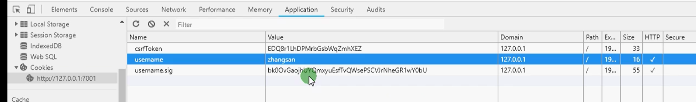
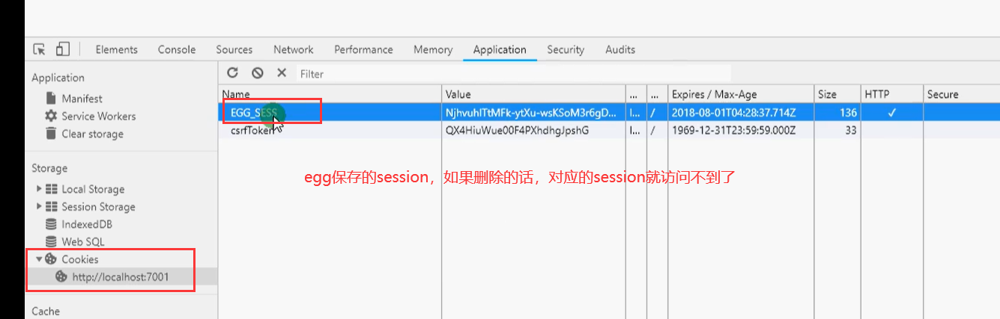
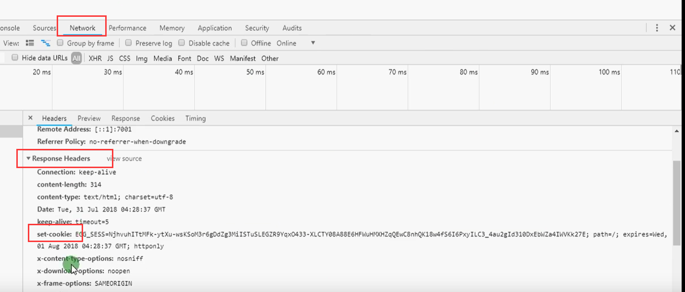
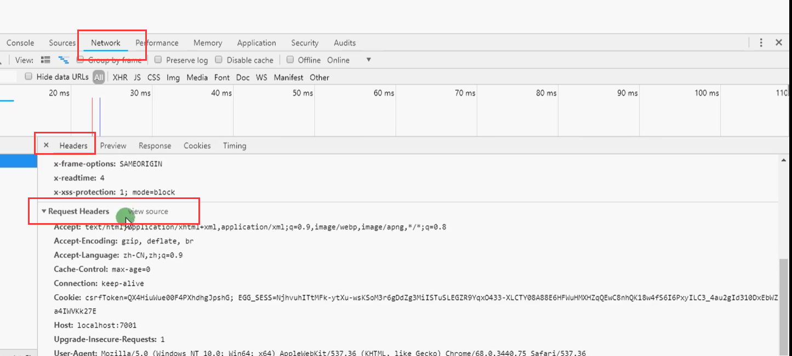

## day01 

### B/S

不需要安装包

### C/S

需要安装包


express 

koa2

egg


# git

git 是一个开源的分布式版本控制系统，可以有效、高速地处理从很小到非常大的项目版本管理

+ 用途
  + 版本管理
  + 团队协作
+ 版本控制系统
  + git：分布式，可以先提交到本地，等有网的时候再提交到远程上
  + svn：集中式版本管理，所有提交的东西都在服务器上面，如果没有网的话，就提交不了

+ 全局配置
  + 用户名：git config --global user.name xxx
  + 邮箱：git config --global user.email xxx


### git本地仓库

新建文件夹： mkdir 1807A

然后cd到新建的文件夹里面 

然后 git init  初始化,会在1807A文件夹里面生成一个.git  可能是一个隐藏文件夹，在查看里面设置一下

直接在本地init，但是没有提交过，可能没有master分支

.git 是 git的本地版本库，除了.git 以外的文件和文件夹都是工作区，文件夹下面只能有一个.git文件，里面嵌套的文件夹也不能有

git status   查看暂存区和工作区的状态

git add .  也可以是 git add 文件名  把工作区的修改提交到 暂存区

git add . 之后，再git status,会显示 No commits yet  蓝色的 new file: README.md

提交：git commit -m "描述"    把修改从暂存区提交到本地仓库

git log  日志

git reset --hard commit的名字

只要修改了文件，就需要git add 然后 git commit


git remote -v  检测有没有和个人线上仓库绑定到一起

git remote add origin github仓库的SSH地址

add完之后，git remote -v 检测有没有绑定到一起

git push origin master // 可能要输入密码


git branch 显示有哪些分支

git branch 分支名  创建新分支

git branch -a 查看本地和远程的分支

git branch -r 查看远程分支

git branch -d lei  // 删除lei这个分支，前提是lei没有被选中

git checkout lei  // 选中lei这个分支，切换分支的时候，本地工作区是干净的，如果不能被切换，试一下，git add，git commit 

git push origin lei  // 会发出警告，可能需要输入密码，把本地的分支推送到远程，在本地版本库的修改才能推送到远程

git diff 查看工作区的详细修改

git diff --cached 查看暂存区的详细修改

git checkout -b 分支名  相当于 git branch 分支名  +  git checkout 分支名  （新建分支并且切换分支）

开发到一半，需要切换到其他分支，但是不能产生记录，不想进行 git add  和 git commit 操作，可以用 git stash

git stash  把当前分支保存起来，和去暂存区不一样

git stash pop 恢复分支

1. 创建 mkdir 文件名

2. 进入这个文件 cd 文件名

3. pwd ：作用 命令用于显示当前目录
    通过git init命令把这个目录变成Git可以管理的仓库

4. git init
    Initialized empty Git repository in /Users/michael/learngit/.git/
   （如果你没有看到.git目录，那是因为这个目录默认是隐藏的，用ls -ah命令就可以看见。）
    把一个文件放到Git仓库只需要两步

5. git add .

   readme.cd （创建 文件）

   用命令git commit告诉Git，把文件提交到仓库

6. git commit -m "wrote a readme file"

  	 [master (root-commit) eaadf4e] wrote a readme 
  	  1 file changed, 2 insertions(+)
  	   create mode 100644 readme.txt

  （ git commit命令执行成功后会告诉你，1 file changed：1个文件被改动（我们新添加的readme.txt文件）；2 insertions：插入了两行内容（readme.txt有两行内容）)

7. 再次执行  git commit -m 'wrot' 
    	git add . 表示 会把本地所有untrack的文件都加入暂存区 提交新文件(new)和被修改(modified)文件，不包括被删除(deleted)文件
       git status
8. git remote add origin shh协议路径
9. git push oragin master  出来 书写 密钥  shidingding


### 撤销修改和版本回退

#### 撤销工作区的修改

git checkout -- 文件路径

#### 撤销暂存区的修改

第一步：git reset 文件路径

第二步：git checkout -- 文件路径

#### 版本回退

git reset --hard HEAD^    回退到上一个版本

git reset --hard commit_id   回退到指定版本


### 删除分支

git branch -d 分支名  删除本地分支

git push origin -d zhangsan  删除远程分支


### git仓库主要流程

#### 两种关联远程仓库的方法

  + 方法一

    - 到github上在仓库Clone or download下拉列表中找到以[git@github.com](mailto:git@github.com):开头的仓库SSH地址并复制（因为HTTPS较慢，一般用SSH地址）

    - 在本地执行命令：

        ```
        git remote add origin 你复制的地址
        ```

    ​		注意：如果远程仓库中有文件，本地第一次push之前需要执行：`git pull origin master`

    - 执行关联命令：

        ```cmd
        git push -u origin master
        ```

        注意：如果需要重新关联一个origin需要执行命令：

        ```cmd
        git remote rm orgin
        git remote add origin xxxxx
        git push -u origin master
        ```
    
+ 方法二
  
    - 到github上在仓库Clone or download下拉列表中找到以[git@github.com](mailto:git@github.com):开头的仓库SSH地址并复制（因为HTTPS较慢，一般用SSH地址）
    
    - 在本地执行命令：
    
      ```
      git clone 你复制的地址
      ```
    
    ​		注意：如果远程仓库中有文件，本地第一次push之前需要执行：`git pull origin master`
    
    该方法比较省力，省去了执行命令git remote add origin和git push -u origin master
    
    但如果重新关联的话还是要用到上面2条命令的

#### 主要流程


组长先建一个仓库

分为远程仓库 和 本地仓库

新建好的时候，远程仓库有一个master分支

+ 在桌面上新建一个zuzhang文件夹

  git clone https链接或者是ssh钥匙， 克隆的是主分支里面的文件

  cd 到文件夹里面

  现在在本地的master分支里面，但是不能在master分支上面开发，所以要新建分支

  **git checkout -b dev**   基于master分支新建一个开发分支，

  **git checkout -b zuzhang**   基于dev分支新建一个组长分支

  这两个新建的分支都是本地的

  在 文件夹里面进行一些修改，可以修改一些文件的内容或者新建一个文件夹

  **git add .**

  **git commit -m '描述'**

  会提交到 zuzhang 分支里面去

  把 zuzhang 本地分支 的修改 传到远程仓库里面 **git push origin zuzhang**

  然后 把 zuzhang 分支里面 修改过的文件 合并到 本地的 dev 分支里面

  要先切换到 dev 分支里面 **git checkout dev**   **git merge zuzhang**   **git push origin dev**


小组成员里面有一个 张三

+ 新建一个 zhangsan 文件夹

  git clone https链接或者是ssh钥匙  克隆的是主分支里面的文件

  cd 到文件夹里面

  现在在本地的master分支里面，但是不能在master分支上面开发，所以要新建分支

  **git checkout -b dev**   新建一个开发分支，

  **git pull origin dev**   把远程dev分支里面的东西合并到本地dev分支里面

  **git checkout -b zhangsan**   基于新合并的 dev 分支 新建一个 zhangsan 分支

  这两个新建的分支都是本地的

  在 文件夹里面进行一些修改，可以修改一些文件的内容或者新建一个文件夹

  **git add .**

  **git commit -m '描述'**

  会提交到 zhangsan 分支里面去

  把 zhangsan本地分支 的修改 传到远程仓库里面 **git push origin zhangsan**

  然后 把 zhangsan 分支里面 修改过的文件 合并到 本地的 dev 分支里面，再上传到远程 dev 分支里面

  要先切换到 dev 分支里面 **git checkout dev**   **git merge zhangsan**   **git push origin dev**


小组成员里面有一个 李四，在和张三同时开发

+ 新建一个 lisi 文件夹

  git clone https链接或者是ssh钥匙  克隆的是主分支里面的文件

  cd 到文件夹里面

  现在在本地的master分支里面，但是不能在master分支上面开发，所以要新建分支

  **git checkout -b dev**   新建一个开发分支，

  **git pull origin dev**   把远程dev分支里面的东西合并到本地dev分支里面

  **git checkout -b lisi**   基于新合并的 dev 分支 新建一个 lisi 分支

  这两个新建的分支都是本地的

  在 文件夹里面进行一些修改，可以修改一些文件的内容或者新建一个文件夹

  **git add .**

  **git commit -m '描述'**

  会提交到 lisi 分支里面去

  把 lisi 本地分支 的修改 传到远程仓库里面 **git push origin lisi**

  然后 把 lisi 分支里面 修改过的文件 合并到 本地的 dev 分支里面

  要先切换到 dev 分支里面 **git checkout dev**   **git merge lisi**   **git push origin dev**

  

张三和李四一起推送的话可能会报错，

要先拉取 远程 dev 分支里面的内容 **git pull origin dev**

**ctrl + C :qa!**


如果张三和李四修改同一行的话，在张三执行 **git push origin dev** 的时候也会报错，

在张三的文件里面，找到修改的那一行，保留一个最终的方案

然后

**git add .**

**git commit -m '描述'**

**git push origin dev**


组长进行最后的合并,合并到 master 上面

在 本地的 dev 分支上面

**git pull origin dev**

**git checkout master**

**git merge dev**


### 码云 github coding

#### 加密传输协议

https   需要输入用户名和密码

ssh       需要配置公钥和密码

### 生成公钥和秘钥

ssh-keygen 然后回车，会有一系列的问题


### [rebase 用法小结](https://www.jianshu.com/p/4a8f4af4e803)


## 脚手架

   

脚手架（也就是cli）： 创建命令，可以创建可交互的命令(例如vue的选配)，然后操作文件
   process： 过程，进程
   process.argv: 获取参数数组
   command：命令
   入口文件command.js 
   头部声明(固定内容，不可更改)：#! /usr/bin/env node
   用管理员权限启动窗口，苹果就是在前面加一个sudo

实训： 

vue3.0

ts + hooks

uni-app

源码

nvm list

nvm use 13.2.0

## commander

### program

#### .option定义选项

```js
const {program} = require('commander');
const package = require('./package.json');

program.version(package.version);

// .option定义选项
program
	// 布尔型选项，选项不配置参数
    .option('-d, --debug', 'outout extra debugging')
    .option('-s, --small', '小号pizza')
	// 设置参数的选项，用尖括号声明，可以有默认值
    .option('-p, --pizza-type <type>', '各种口味');

// 处理参数(注意，处理参数的调用，写在program的链式调用，也就是各种选项，子命令的配置后面)
program.parse(process.argv);

// 命令行的命令不一样，打印结果不一样
console.log(program.small);  
console.log(program.pizzaType); 

if(program.pizzaType) {
    // 如果是这个选项，执行的参数
}


// mycli -p carrot
// undefined
// carrot

// mycli -s
// true
// undefined

// mycli -s -p carrot
// true
// carrot

// mycli -p carrot -s
// true
// carrot

```

#### .command() .addCommand() 配置命令

.command()的第一个参数可以配置命令名称及参数，参数支持必选（尖括号表示），可选（方括号表示）及变长参数（点号表示，如果是用，只能是最后一个参数）；
是用.addCommand()向program增加配置好的子命令

```js
program
    .command('clone <source> [destination]')
    .description('clone a repository into a newly create directory')
    .action((source, destination) => {
    	// source, destination 的值 是上面command 命令后面的参数
    	// action 的第一个参数，指向clone命令后面的参数，和变量名没有关系，
    	// 把action里面的回调函数里面source参数，名字改一下，还是会打印clone后面的名字
        console.log(source, destination);
    })

// 添加子命令
const brew = program.command('brew');

brew
    .command('tea')
    .action(() => {
        console.log('brew tea');
    });
brew
    .command('coffee')
    .action(() => {
        console.log('brew coffee');
    });

program.parse(process.argv);

// mycli brew coffee
console.log(process.argv.slice(2)); // ['brew', 'coffee']


program
    .command('aa <dir-name>')
    .option('-r, --recursive', '是否递归展示目录')
    .description('创建一个项目')
    .action((dirname, cmdobj) => {
    	// mycli aa dir
    	// 打印出来 dir undefined
    	// mycli aa dir --recursive
    	// dir true
        console.log(dirname, cmdobj.recursive);
    	// 如果命令后面加了small，打印cmdobj.small，会返回undefined，
    	// 可能因为small这个选项不在aa子命令里面
    })

program.parse(process.argv);

```


#### .addCommander()

```js
const {program} = require('commander');
const commander = require('commander');

function makeHeatCommand() {
    const heat = new commander.Command('heat');
    heat
        .command('jug')
        .action(() => {
            console.log('heat jug');
        });
    heat
        .command('pot')
        .action(() => {
            console.log('heat pot');
        });
    return heat;
}

// mycli heat pot
program.addCommand(makeHeatCommand()); 

console.log(process.argv.slice(2)); // [ 'heat', 'jug' ]

program.parse(process.argv);

// mycli heat pot
// heat pot
```


## inquirer

下包然后直接引入

### .prompt

创建交互式表单，在node模拟表单的实现

```js
const inquirer = require('inquirer');

const promptList = [];

```


## process 当前文件的进程对象

可以直接打印 console.log(process)

```js
function add(a, b) {
    console.log(Number(a) + Number(b))
}
// 获取到的是字符串形式的
add(process.argv[2], process.argv[3]);
```


## koa

```js
cnpm i -S koa
const Koa = require('koa');
const app = new Koa();
app.use(async ctx => {
    // ctx.body只能支持同步的结果，mysql.query是异步的，直接在query里面赋值的话，返回不到	// 页面上
    ctx.body = 'Hello World'
})
"script": {
    "start":""
}
app.listen(3999);

从浏览器的缓存里面去找的icon图标
```

#### koa-router

```cmd
cnpm i -S @koa/router
const Router = require('@koa/router');
const router = new Router();
app.use(router.routes())
```

##### 路由中间件

```js
cnpm i -S @koa/router
const Router = require('@koa/router');
const router = new Router();
const bodyparser = require('koa-bodyparser');
let bodyparserMiddleware = bodyparser();
// 中间的这个回调函数，被称为路由级中间件
router.get('/api', () => {}, ctx => {
    ctx.body = {
        code: 1,
        msg: 'success'
    }
})

router.post('/api', bodyparserMiddleware, ctx => {
    ctx.body = {
        code: 1,
        msg: 'success'
    }
})

app.use(router.routes())
```


#### koa-static
解析静态参数
```js
const static = require('koa-static')
// 打印一下__dirname的具体路径，public文件夹下面放置静态文件
const main = static(__dirname + '/public');
app..use(main)
```

#### koa-bodyparser

```js
const bodyparser = require('koa-bodyparser');
app.use(bodyparser())
```


### 洋葱模型

### mysql

一定要设置主键

```js
cnpm i -D mysql
const mysql = require('mysql');
var mysql      = require('mysql');
var connection = mysql.createConnection({
  host     : 'localhost',
  port	   : 3306, // 端口
  user     : 'me',
  password : 'secret',
  database : 'my_db'
});
connection.connect();
module.exports.query = (sql, opt = []) => {
    return new Promise((resolve, reject) => {
        connection.query(sql, opt, (err, res) => {
            if(err) {
                reject(err)
            } else {
                resolve(res)
            }
        })
    })
}
```


#### mysql命令

```js
'select * from user' 查
`delete from users where id=${id}` 删
`insert into users (name, age) values ('${name}', '${pwd}')` 增
`update users set name='${name}', age='${age}' where id=${id}`  改

// 两个参数
'UPDATE users SET foo = ?, bar = ?, baz = ? WHERE id = ?', ['a', 'b', 'c', userId]
```


#### mysql数据关联


```js
'SELECT list.tit,first.id,second.tit FROM list,first,second where first.ftit=second.ftit and second.ftit = "不是好人"'
```


## egg(约定 > 配置)

### egg post 的安全校验

```js
// config/config.default.js

config.security = {
    csrf: {
        enable: false
    }
}
```


### egg-mysql

cnpm i -S egg-mysql


```js
config.keys = appInfo.name + '_1611041033297_1776'; // 应用key名
config.middleware = []; 
```


### MVC

模型 视图 控制器

+ 模型
  - 数据模型，从数据库去查找数据，在egg的service文件夹里面写
+ 视图
+ 控制器
  - 写路由逻辑，在controller里面写

### 渲染视图

在app里面新建view文件夹，放入一个html文件

配置完之后重新启动项目

ejs是模板引擎，在官网上用的是egg-view-nunjucks

```js
// controller/home.js
ctx.body = await ctx.renderView('../view/index.html');

// config/config.default.js
config.view = {
    config.view = {
        defaultViewEngine: 'ejs',
        mapping: { // mapping是映射，也就是要解析哪些文件
			'.html': 'ejs'
        }
	}
}

// config/plugin.js
module.exports = {
    ejs: {
        enable: true,  // true说明使用ejs
        package: 'egg-view-ejs'  // 指明插件的位置
    }
}
```


### egg的目录资源

+ app 项目资源

  - controller 控制器
  - service 服务
  - public 静态资源服务器 css,images

+ config 项目配置

  - config.default.js ： 应用配置
  - plugin ： 插件配置

+ log 日志文件

+ run

+ typings

+ test

+ .eslintignore  忽视某些规则

+ .eslintrc 使用某些规则

  eslint 规范有三个


 ### 在egg中cookie的设置和获取

```js
this.ctx.cookies.set('name', 'zhangsanfeng')
this.ctx.cookies.get('name')
```

 在首页通过cookie设置一个值，在新闻页获取

```js
// controller/home.js

'use strict';

const Controller = require('egg').Controller;

class HomeController extends Controller {
    // 首页
    async index() {
        this.ctx.cookies.set('username', 'zhangsan', {
            // 第三个参数设置cookie是否过期，是否加密
            // 默认情况下，当浏览器关闭以后，cookies就销毁了
            // 默认情况下，egg.js里面的cookies没法设置中文
            maxAge: 24 * 3600 * 1000, // 24小时 设置过期时间后，关闭浏览器，重新打开，cookies还存在
            httpOnly: true, // true 表示，只能在node.js中访问
            encrypt: true, // true 表示 对cookie进行加密，如果cookie加密，那么获取的时候，要进行解密操作，加密之后，就可以设置中文cookie
            signed: true, // 表示对cookies进行签名，防止用户修改cookie，双击修改，修改完以后，就访问不到了
        })
        
        await this.ctx.render('home'); // home 来自app/view/home.html
    }
}

module.exports = HomeController;

```

在新闻页获取cookie

```js
// controller/news.js

'use strict';

const Controller = require('egg').Controller;

class NewsController extends Controller {
    // 新闻页
    async index() {
        this.ctx.cookies.get('username', {
            encrypt: true // 对加密的cookie进行解密
        })
        await this.ctx.render('news'); // home 来自app/view/home.html
    }
}

module.exports = NewsController;
```



清除cookie

```js
this.ctx.cookies.set('name', null);
 
// 可以声明一个函数
async loginOut() {
    this.ctx.cookies.set('username', null);
    this.ctx.redirect('/news'); // 路由跳转
}
// 或者是maxAge设置为0
```


### egg.js中session的使用

egg.js 中 session 基于 egg-session 内置了对 session 的操作

 设置session

```js
this.ctx.session.username = '张三';
```


获取session

```js
var username = this.ctx.session.username;
```


访问session需要本地保存的cookie


在index.html 中设置session，访问这个页面的时候，响应头中会带有set-cookies






EGG_SESS是默认的key，后面是value，默认的过期时间是24小时，默认httpOnly：true，excrypt：true


在 news.html中访问session，在请求头中，会有Cookies和EGG_SESS




在config.default.js里面可以配置session

```js
config.session = {
    key: 'SESSION_ID',
    maxAge: 89093,
    renew: true,// 延长会话有效期，每次访问页面，session的延长时间会被重新设置一次，为了保证用户正在操作的过程中，session不过期
}
```


